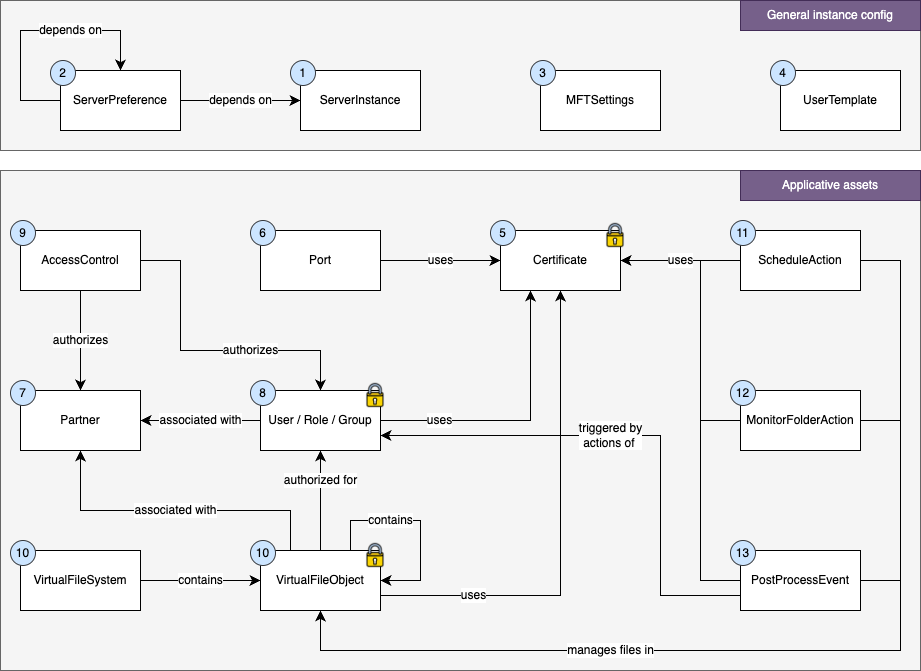

# webMethods MFT assets

The following diagram depicts the MFT assets and their relationships.

These assets are numbered to indicate in which order they should be created using the API, taking into account dependencies.  
The small lock icon is used to indicate the assets containing secret data.